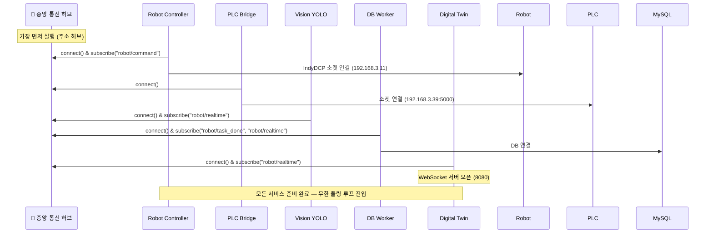
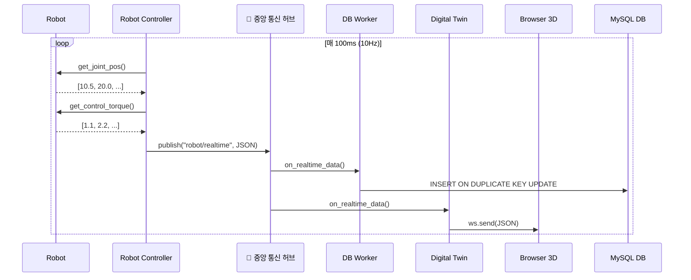
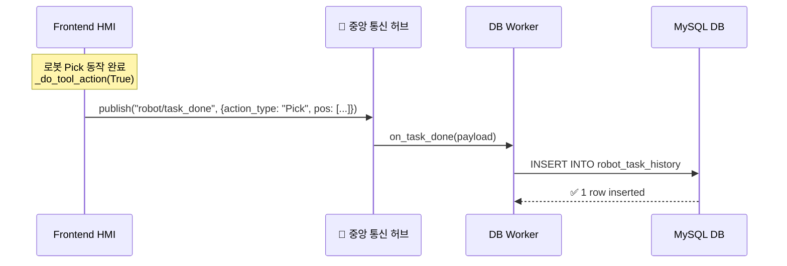
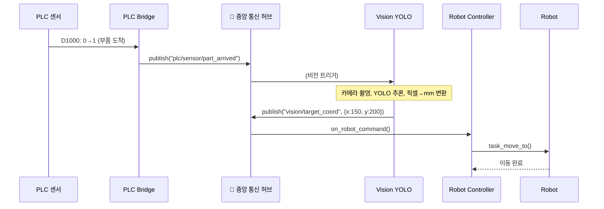

# 📦 Backend — Docker Microservices 상세 가이드

이 폴더는 Indy7 HMI 시스템의 **백엔드 엔진**입니다.
6개의 독립적인 마이크로서비스가 Docker 컨테이너로 실행되며, **중앙 통신 허브(Event Bus)**를 통해 서로 소통합니다.

처음 실행하는 사용자는 루트의 [`BEGINNER_RUN_GUIDE.md`](../BEGINNER_RUN_GUIDE.md)를 먼저 보세요. Docker Desktop에서 UI 화면이 뜨지 않는 이유와 통신 확인 방법까지 순서대로 정리되어 있습니다.

> 💡 중앙 통신 허브의 내부 구현 기술은 MQTT(Mosquitto) 프로토콜이지만, 개념적으로는 "**모든 서비스들이 자기 할 일만 하고, 데이터를 허브에 던지는 우체국**" 역할입니다.

---

## 🚀 실행 방법

### 현재 방식 (도커 없이, UI에서 직접 제어)
```bash
cd ../frontend
python run_ui_only.py
```
UI가 뜨면 우측 상단 **[🔌 서비스 관리]** 버튼을 눌러 각 백엔드 서비스를 ON/OFF 합니다.

### Docker 실행
```bash
cd /Users/leejaeheung/Documents/Busan_Project/Indy7_HMI_Clean/backend
cp .env.example .env

# 기본 인프라와 기록/트윈 서비스 실행
docker compose build
docker compose up -d message_broker db_worker digital_twin

# 실제 로봇/PLC 연결이 필요할 때 추가 실행
docker compose up -d robot_controller plc_bridge

# 카메라/YOLO 서비스는 필요할 때만 실행
docker compose --profile vision up -d vision_yolo

# 로그 실시간 확인
docker compose logs -f robot_controller

# 전체 종료
docker compose down
```

이미 GitHub Container Registry에 업로드된 이미지를 받아 실행할 때는 빌드 없이 registry compose 파일을 사용합니다.

```bash
docker compose -f docker-compose.registry.yml pull
docker compose -f docker-compose.registry.yml up -d message_broker db_worker digital_twin
```

자세한 배포 절차와 `.env` 항목은 [`DOCKER_DEPLOYMENT.md`](./DOCKER_DEPLOYMENT.md)를 기준으로 관리합니다.
Windows 현장 PC 기준 배포는 [`DOCKER_WINDOWS_DEPLOYMENT.md`](./DOCKER_WINDOWS_DEPLOYMENT.md)를 참고합니다.

---

## 🏗 내부 폴더 구조 (전체)

```text
backend/
├── docker-compose.yml              # 전체 6개 서비스 오케스트레이션
├── docker_architecture.md          # 아키텍처 설계 문서
├── docker/                         # Dockerfile 모음
│   ├── robot_controller.Dockerfile
│   ├── digital_twin.Dockerfile
│   ├── vision_yolo.Dockerfile
│   ├── plc_bridge.Dockerfile
│   └── db_worker.Dockerfile
│
├── robot_controller/               # 🤖 서비스 1: 로봇 컨트롤러
│   ├── .devcontainer/              # VSCode 개발 컨테이너 설정
│   ├── requirements.txt            # paho-mqtt
│   ├── README.md                   # 서비스별 상세 문서
│   ├── src/
│   │   ├── main.py                 # 진입점
│   │   ├── domain/                 # 모션 계획, 경로 검증 로직
│   │   └── infrastructure/
│   │       ├── mqtt_manager.py     # MQTT Pub/Sub 클래스
│   │       └── indy_utils/         # IndyDCP 소켓 SDK (독립 복사본)
│   └── tests/
│       └── test_robot_controller.py
│
├── digital_twin/                   # 🌍 서비스 2: 디지털 트윈
│   ├── requirements.txt            # paho-mqtt, websockets
│   ├── src/
│   │   ├── main.py                 # 웹소켓 서버 + MQTT 구독
│   │   ├── domain/                 # 클라이언트 세션 관리
│   │   └── infrastructure/
│   │       └── mqtt_manager.py
│   └── tests/
│
├── vision_yolo/                    # 👁 서비스 3: 카메라 YOLO
│   ├── requirements.txt            # paho-mqtt, opencv, ultralytics, torch
│   ├── src/
│   │   ├── main.py                 # 카메라 캡처 + 추론 루프
│   │   ├── domain/                 # 픽셀→mm 좌표 변환
│   │   └── infrastructure/
│   │       └── mqtt_manager.py
│   └── tests/
│
├── plc_bridge/                     # ⚙️ 서비스 4: PLC 브리지
│   ├── requirements.txt            # paho-mqtt, pymcprotocol
│   ├── src/
│   │   ├── main.py                 # PLC 레지스터 폴링 루프
│   │   ├── domain/                 # 센서 상태 전이 로직
│   │   └── infrastructure/
│   │       └── mqtt_manager.py
│   └── tests/
│
└── db_worker/                      # 🗄 서비스 5: DB 워커
    ├── requirements.txt            # paho-mqtt, PyMySQL
    ├── src/
    │   ├── main.py                 # MQTT 구독 → DB Insert
    │   ├── domain/                 # 데이터 정제 로직
    │   └── infrastructure/
    │       ├── mqtt_manager.py
    │       └── database_repository.py  # PyMySQL UPSERT/INSERT
    └── tests/
```

---

## 🔄 프로그램 실행 흐름 (시퀀스 다이어그램)

### 1. 시스템 부팅 시퀀스



### 2. 실시간 로봇 상태 전송 흐름 (10Hz, 매 100ms)



### 3. Pick & Place 작업 완료 → DB 기록 흐름



### 4. PLC 센서 감지 → 비전 → 로봇 자동 Pick 흐름



---

## 📡 통신 채널 맵 (전체 통신 규약)

> 내부적으로 MQTT 프로토콜을 사용하며, 각 채널은 "topic" 단위로 구분됩니다.

| 통신 채널 (topic) | 발행자 | 구독자 | Payload 예시 |
|---|---|---|---|
| `robot/realtime` | robot_controller | db_worker, digital_twin | `{"robot_id":"Indy7", "q":[10,20,...], "torque":[1,2,...], "busy":0}` |
| `robot/command` | frontend(HMI) | robot_controller | `{"type":"Move", "pos":[0.3,-0.4,0.2,180,0,180]}` |
| `robot/task_done` | frontend(HMI) | db_worker | `{"robot_id":"Indy7", "action_type":"Pick", "pos":[0.35,-0.45,0.2]}` |
| `vision/target_coord` | vision_yolo | robot_controller | `{"x":150.5, "y":200.0, "class":"box"}` |
| `plc/sensor/part_arrived` | plc_bridge | vision_yolo, robot_controller | `{"status":1}` |

---

## 🧩 각 서비스별 핵심 함수 요약

### 🤖 robot_controller (`src/main.py`)
| 함수 | 역할 |
|---|---|
| `main()` | IndyDCP 소켓 연결 → 10Hz 무한루프에서 `get_joint_pos()`, `get_control_torque()` 호출 → MQTT `robot/realtime` 발행 |
| `on_robot_command(payload)` | MQTT `robot/command` 수신 → `inst.task_move_to()` 등 실제 로봇 명령 실행 |

### 🌍 digital_twin (`src/main.py`)
| 함수 | 역할 |
|---|---|
| `ws_handler(websocket, path)` | 웹 브라우저 클라이언트 접속 시 `connected_clients` Set에 등록/해제 (비동기) |
| `on_realtime_data(payload)` | MQTT `robot/realtime` 수신 → 모든 웹소켓 클라이언트에게 JSON 브로드캐스트 |
| `start_mqtt()` | MQTT 구독을 별도 백그라운드 스레드에서 구동 (웹소켓 이벤트루프 안 막히게) |

### 👁 vision_yolo (`src/main.py`)
| 함수 | 역할 |
|---|---|
| `main()` | `cv2.VideoCapture()` 프레임 획득 → YOLO 추론 → 픽셀→mm 좌표 변환 → MQTT `vision/target_coord` 발행 |

### ⚙️ plc_bridge (`src/main.py`)
| 함수 | 역할 |
|---|---|
| `main()` | `pymcprotocol.Type3E` 소켓 연결 → 100ms 간격 `batchread_wordunits("D1000")` → 상승 에지 감지 시 MQTT `plc/sensor/part_arrived` 발행 |

### 🗄 db_worker (`src/main.py`)
| 함수 | 역할 |
|---|---|
| `on_realtime_data(payload)` | MQTT `robot/realtime` 수신 → `INSERT ... ON DUPLICATE KEY UPDATE` (UPSERT) |
| `on_task_done(payload)` | MQTT `robot/task_done` 수신 → `INSERT INTO robot_task_history` |

### `database_repository.py` (db_worker 내부)
| 함수 | 역할 |
|---|---|
| `_get_persistent_connection()` | PyMySQL 커넥션 1개를 재사용 (100ms 간격 부하 최소화) |
| `insert_realtime_data(robot_id, data)` | `robot_realtime_status` 테이블에 UPSERT |
| `insert_task_completion(robot_id, action, pos)` | `robot_task_history` 테이블에 INSERT |

---

## 📱 APK (Conty) JSON 파일 호환성

Android 태블릿의 Conty 앱에서 작성한 로봇 프로그램 JSON 파일을 **이 시스템에서 그대로 불러와 실행**할 수 있습니다.

### JSON 파일 구조 (APK 원본 그대로)
```json
{
  "info": { "name": "test_1" },       // 프로그램 이름

  "wpList": [                          // 📍 웨이포인트(좌표) 목록
    {
      "id": 0,
      "type": 0,
      "p": [0.212, -0.613, 0.320, ...],  // Task 좌표 (X,Y,Z,U,V,W)
      "q": [-54.18, -39.57, ...],         // Joint 좌표 (6축 각도)
      "blendRadius": 0,
      "stopBlend": true
    }
  ],

  "program": [                         // 🧩 프로그램 트리 (실행 순서)
    { "type": 999, "id": 1,           // Root 노드 (설정 정보)
      "toolInfo": [...],               //   - 툴 설정 (Hold/Release DO매핑)
      "palletInfo": [...],             //   - 팔레타이징 설정 (P1~P4, M×N 배열)
      "collisionPolicy": {...}         //   - 충돌 정책
    },
    { "type": 2,  "id": 2, "varList": [...] },    // 변수 선언 (Math)
    { "type": 20, "id": 3, "count": 5 },          // Loop (5회 반복)
    { "type": 29, "id": 4, "diList": [...] },      // Wait DI (센서 대기)
    { "type": 24, "id": 5, "cond": {...} },        // If 분기
    { "type": 201,"id": 6, "target":{...},         // ⭐ Pick 동작
      "approach": {...}, "retract": {...} },
    { "type": 202,"id": 8, "target":{...},         // ⭐ Place 동작
      "approach": {...}, "retract": {...} },
    { "type": 100,"id": 7 },                       // Move Home
    { "type": 3,  "id": 15, "varList": [...] }     // Math (count+1)
  ],

  "moveList": [                        // 🏃 이동 명령 목록
    {
      "name": "1__copy1",
      "type": 102,                     // Joint Move
      "wpList": [{"id": 0, "t": 2}],  // wpList[0]번 좌표 사용
      "boundary": {"velLevel": 3, "accLevel": 1}
    }
  ]
}
```

### 노드 타입 코드 매핑 (type 번호 → 기능)
| type | 이름 | 설명 |
|------|------|------|
| `999` | Root | 프로그램 루트 (툴/팔레트/충돌 설정 포함) |
| `100` | Move Home | 홈 위치로 이동 |
| `101` | Frame Move | Task 좌표 기반 이동 |
| `102` | Joint Move | Joint 좌표 기반 이동 |
| `201` | **Pick** | Approach → 타겟 이동 → Hold(잡기) → Retract |
| `202` | **Place** | Approach → 타겟 이동 → Release(놓기) → Retract |
| `2` | 변수 선언 | varList로 변수 초기화 |
| `3` | Math | 변수 연산 (count+1 등) |
| `20` | Loop | count회 반복 |
| `24` | If (조건) | left op right 조건 분기 |
| `29` | Wait DI | 디지털 입력 센서 대기 |
| `30` | DO | 디지털 출력 제어 |

### 어디에서 어떻게 사용되나?

```mermaid
flowchart TD
    A[APK에서 저장된 JSON 파일] -->|불러오기| B(frontend/user_programs/로봇명/program.json)
    
    subgraph Frontend [Frontend HMI (robot_hmi_view.py)]
        B -->|json.load()| C{_load_program_from_json()}
        C -->|파싱| D((화면 TreeView에 노드로 표시))
        
        D -->|▶️ 재생 버튼 클릭| E{_execute_node_list()}
        E -->|type==201| F[Pick 동작 실행<br>Approach → Hold → Retract]
        E -->|type==202| G[Place 동작 실행<br>Approach → Release → Retract]
        E -->|type==20| H[Loop 동작 실행<br>count만큼 자식 노드 반복]
    end
    
    F -->|작업 완료| I[MQTT: publish('robot/task_done')]
    G -->|작업 완료| I
    
    subgraph Backend [Backend Microservices]
        I -->|subscribe| J[db_worker]
        J -->|INSERT| K[(MySQL DB 이력 저장)]
    end
```

### Pick/Place 동작의 3단계 시퀀스
JSON 안의 Pick/Place 노드는 내부적으로 **3단계 자동 시퀀스**로 실행됩니다:
```
1) Approach (접근)    ── target 좌표 위 distance(0.15m) 만큼 위에서 대기
2) Target (타겟)      ── 실제 물건 위치로 하강 → Hold(DO 켜기) 또는 Release(DO 끄기)
3) Retract (후퇴)     ── 완료 후 다시 distance만큼 위로 상승하여 안전 이탈
```

---

---

## 🧪 단위 테스트 (TDD)
각 서비스 폴더 내에서 독립 실행 가능합니다.
```bash
cd db_worker && pytest tests/
cd plc_bridge && pytest tests/
cd robot_controller && pytest tests/
```

---

## 🤖 AI 분석 가이드 — Conty JSON 파일 분석 시 필독

> **⚠️ AI 에이전트에게**: 사용자가 Conty JSON 파일(`.7.json`)을 제공하며 분석을 요청할 경우,
> **반드시** 아래 문서를 먼저 읽고 참조한 뒤 분석을 수행하세요.

### 📖 참조 문서
```
docs/conty_node_reference.md
```

이 문서에는 다음 내용이 **상세하게** 기록되어 있습니다:
- **30+ 노드 타입의 JSON 필드 구조** (type 번호 → 필드명 → 데이터 타입 → 편집 가능 여부)
- **3-Level Reference Resolution** (program → moveList → wpList 좌표 참조 체계)
- **Pick & Place 동작 시퀀스** (approach → target → Hold/Release → waitTime → retract)
- **팔레트 좌표 계산 공식** (P1/P2/P3 기반 그리드 보간)
- **고정값 vs 가변값 가이드** (편집해야 하는 필드 vs 시스템 고정 필드)
- **자주 사용되는 프로그래밍 패턴** (Loop+Pick+Place, DO+WaitDI 등)

### 분석 절차
1. `docs/conty_node_reference.md`를 읽어 노드 타입 사전을 숙지합니다.
2. 사용자 JSON의 `program` 배열을 순회하며 각 노드의 `type`을 참조 문서와 대조합니다.
3. `moveList` → `wpList` 참조를 추적하여 실제 로봇 좌표를 해석합니다.
4. `type=999` 노드의 `toolInfo`/`palletInfo`를 확인하여 Pick/Place 동작의 그리퍼 설정과 팔레트 배열을 파악합니다.
5. 분석 결과를 사용자에게 **동작 순서도** 형태로 정리하여 전달합니다.
