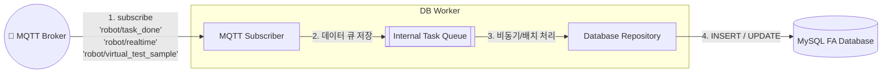

# 🗄 DB Worker 서비스

이 마이크로서비스는 Indy7 로봇과 관련된 데이터를 영구적으로 보존하기 위해 **MySQL (또는 다른 FA DB)**와 소통하는 브리지 역할을 수행합니다. 프론트엔드나 로봇이 직접 DB에 접근하지 않고, MQTT를 통해 데이터를 던지면 이 워커가 주워서 DB에 적재하는 완벽한 비동기 아키텍처를 구현합니다.

---

## 🧩 아키텍처 및 통신 구조



## 🛠 주요 기능 (Features)

1. **로봇 상태 실시간 기록 (Realtime Telemetry)**
   - 토픽: `robot/realtime`
   - 설명: 0.1초마다 로봇에서 올라오는 조인트 각도(Q)와 토크(Torque) 데이터를 수신하여 DB의 실시간 현황 테이블을 갱신합니다. `INSERT ON DUPLICATE KEY UPDATE` 문법을 사용하여 부하를 최소화합니다.

2. **작업 완료 이력 적재 (Task History)**
   - 토픽: `robot/task_done`, `robot/dry_run_task_done`
   - 설명: 프론트엔드 HMI에서 로봇이 `Pick` 또는 `Place` 동작을 끝냈을 때 날아오는 성공 이벤트를 받아, 범용 이력은 `robot_task_history`에 저장하고 현장 핵심 각도는 `robot_process_angle_log`에 저장합니다.

3. **Dry Run 실시간 샘플 적재**
   - 토픽: `robot/virtual_test_sample`
   - 설명: Page3 Dry Run Recording의 반복횟수, 1~6축 각도, 1~6축 토크, XYZ, TCP 이동 속도(mm/s)를 `robot_dry_run_realtime_samples`에 저장합니다.

4. **장애 격리 (Fault Tolerance)**
   - DB 서버가 다운되더라도 DB Worker만 에러 로그를 뿜을 뿐, 로봇의 실제 움직임(Frontend)이나 센서 통신에는 아무런 영향을 주지 않습니다. DB가 복구되면 다시 정상 적재됩니다.

## 🏗 내부 구조 (스켈레톤 트리)

```text
db_worker/
├── requirements.txt            # DB 및 MQTT 관련 패키지
├── Dockerfile                  # 컨테이너 빌드 파일
├── tests/                      # TDD 테스트 코드
│   └── test_db_worker.py
└── src/                        # 🧠 메인 소스 코드
    ├── main.py                 # 진입점 (무한 대기 루프)
    ├── core/
    │   └── worker.py           # 실제 DB Insert 비즈니스 로직
    └── infrastructure/
        ├── mqtt_manager.py     # MQTT 브로커 구독/발행
        └── db_repository.py    # PyMySQL DB 쿼리 실행기
```

## 🚀 실행 및 테스트

```bash
# 개별 모듈 단위 테스트 (TDD)
cd backend/db_worker
python -m pytest tests/

# 수동 단독 실행 (로컬 테스트용)
python src/main.py
```
