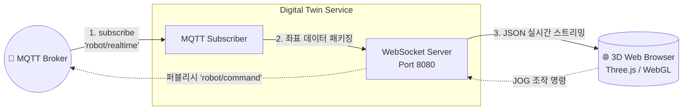

# 🌍 Digital Twin 서비스

이 마이크로서비스는 웹 브라우저 기반의 3D 공간에 현실 로봇과 똑같이 움직이는 가상의 로봇(Digital Twin)을 렌더링하기 위한 **데이터 스트리밍 서버**입니다.

---

## 🧩 아키텍처 및 통신 구조



## 🛠 주요 기능 (Features)

1. **실시간 3D 뷰어용 웹소켓 서버**
   - 로봇 컨트롤러나 프론트엔드에서 수집하여 MQTT로 뿌려지는 `robot/realtime` (초당 10회 이상) 데이터를 읽어들입니다.
   - 읽어들인 6축 조인트 각도(`[j1, j2, j3, j4, j5, j6]`) 데이터를 웹소켓(`ws://0.0.0.0:8080`)을 통해 3D 브라우저 클라이언트에게 밀어줍니다(Push).
   
2. **양방향 통신 (향후 확장)**
   - 브라우저의 3D 화면에서 사용자가 로봇 팔을 마우스로 당기거나(조이스틱 조작), 티칭 포인트를 설정하면 그 역방향 명령을 받아 MQTT `robot/command` 토픽으로 다시 쏴줍니다.

3. **완전한 비종속성 (Decoupling)**
   - 이 서버는 로봇과 직접 소켓(IndyDCP)을 연결하지 않습니다. 오직 MQTT 데이터만 중계하므로, 트래픽이 몰려 웹소켓 서버가 터지더라도 로봇 제어 코어에는 1밀리초의 지연도 주지 않습니다.

## 🏗 내부 구조 (스켈레톤 트리)

```text
digital_twin/
├── requirements.txt            # WebSockets 및 MQTT 패키지
├── Dockerfile                  # 컨테이너 빌드 파일
├── tests/                      # TDD 테스트 코드
│   └── test_digital_twin.py
└── src/                        # 🧠 메인 소스 코드
    ├── main.py                 # 진입점 (Asyncio 루프)
    ├── core/
    │   └── twin_engine.py      # 실시간 좌표 동기화/필터링 로직
    └── infrastructure/
        ├── mqtt_manager.py     # MQTT 브로커 구독
        └── websocket_server.py # 브라우저용 웹소켓 서버 (8080)
```

## 🚀 실행 및 테스트

```bash
# 개별 모듈 단위 테스트 (TDD)
cd backend/digital_twin
python -m pytest tests/

# 수동 단독 실행 (로컬 테스트용)
python src/main.py
```
