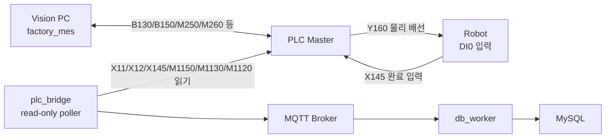

# PLC Bridge 서비스

이 서비스는 미쓰비시 PLC를 읽기 전용으로 감시해서 MQTT 이벤트로 변환합니다. 현장 기준은 **PLC master**입니다.

## 제어 구조



## 감시 신호

| 환경 변수 | 기본값 | 의미 |
|---|---|---|
| `PLC_PROCESS_START_DEVICE` | `X11` | 공정 시작 |
| `PLC_PROCESS_STOP_DEVICE` | `X12` | 공정 정지 |
| `PLC_ROBOT_START_OUTPUT` | `Y160` | PLC에서 Robot DI0으로 가는 물리 출력 |
| `ROBOT_START_DI` | `DI0` | 로봇 시작 입력 |
| `PLC_ROBOT_COMPLETE_DEVICE` | `X145` | 로봇 완료 입력 |
| `PLC_DONE_SIGNAL_MAP` | `PLC150:M1150,PLC130:M1130,PLC120:M1120` | DB 기록 기준 종료 비트 |

## MQTT Topic

| Topic | 조건 |
|---|---|
| `plc/process/start` | `X11` 상승 엣지 |
| `plc/process/stop` | `X12` 상승 엣지 |
| `plc/robot/complete` | `X145` 상승 엣지 |
| `plc/process/done` | `M1150/M1130/M1120` 상승 엣지 |
| `plc/signal` | 감시 중인 신호 값 변경 |

## 실행

```bash
cd /Users/leejaeheung/Documents/Busan_Project/Indy7_HMI_Clean/backend
docker compose up -d --build plc_bridge
docker compose logs -f plc_bridge
```

## 주의

- 기본 동작은 PLC/Robot에 쓰기 명령을 보내지 않습니다.
- Vision 결과는 `factory_mes`의 `*_Process_pendant.py`가 PLC에 직접 씁니다.
- HMI에서 같은 PLC 비트를 동시에 쓰면 래더와 충돌할 수 있습니다.
