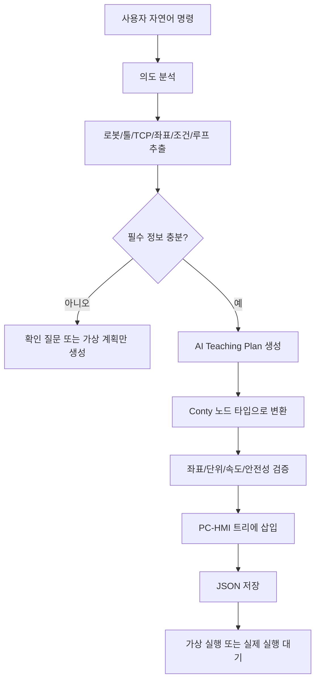

# Indy7 PC-HMI — Deep Space Command Center 🚀

Neuromeka(뉴로메카) **Indy7 협동 로봇**을 위한 PC 기반 HMI 소프트웨어 시스템입니다.

기존의 얽혀있던 구조에서 벗어나 **프론트엔드 UI와 백엔드 마이크로서비스(스레드 기반/도커 기반 선택 가능)를 분리**하여 개발된 클린 아키텍처 기반의 모노레포(Monorepo) 프로젝트입니다.

처음 실행하는 사용자는 먼저 [BEGINNER_RUN_GUIDE.md](./BEGINNER_RUN_GUIDE.md)를 보세요. UI 실행, Windows Docker 설치, Docker 실행, 통신 정상 확인 방법을 순서대로 정리했습니다.

현장 배포는 아래 문서를 역할별로 보면 됩니다.

- Robot Controller PC: [ROBOT_CONTROLLER_PC_SETUP.md](./ROBOT_CONTROLLER_PC_SETUP.md)
- Vision / YOLO PC: [VISION_YOLO_PC_SETUP.md](./VISION_YOLO_PC_SETUP.md)
- 배포 전략: [DEPLOYMENT_STRATEGY.md](./DEPLOYMENT_STRATEGY.md)

로봇/DB/Digital Twin 간 데이터 흐름은 [ROBOT_COMMUNICATION_FLOW.md](./ROBOT_COMMUNICATION_FLOW.md)에 정리되어 있습니다.

Robot A의 2026-05-18 Dry Run Recording 결과와 다음 테스트 레시피는 [docs/robot_a_dry_run_analysis_20260518.md](./docs/robot_a_dry_run_analysis_20260518.md)에 정리되어 있습니다.

---

## ✅ 왕초보 실행 가이드: 이것만 그대로 따라 하세요

아래 명령어는 **Mac 기준**입니다. Windows에서 실행할 때도 원리는 같고, `cd` 경로만 본인 PC 경로에 맞추면 됩니다.

가장 많이 나는 에러는 이겁니다.

```text
no configuration file provided: not found
```

이건 Docker 문제가 아니라 **현재 폴더에 `docker-compose.yml`이 없다는 뜻**입니다. 반드시 `backend` 폴더 안에서 `docker compose`를 실행해야 합니다.

### 0. 처음 Git에서 받는 사람

이미 `/Users/leejaeheung/Documents/Busan_Project/Indy7_HMI_Clean` 폴더가 있으면 이 단계는 건너뛰세요.

```bash
cd /Users/leejaeheung/Documents/Busan_Project
git clone https://github.com/HeungJAELEE/Busan_Robot.git Indy7_HMI_Clean
cd Indy7_HMI_Clean
```

이미 받은 프로젝트를 최신으로 업데이트할 때는:

```bash
cd /Users/leejaeheung/Documents/Busan_Project/Indy7_HMI_Clean
git pull origin main
```

### 1. Python 기본 설치

처음 한 번만 하면 됩니다.

```bash
cd /Users/leejaeheung/Documents/Busan_Project/Indy7_HMI_Clean

python3 -m venv .venv
source .venv/bin/activate

python -m pip install --upgrade pip
pip install -r requirements.txt
pip install -r frontend/requirements.txt
```

다음에 다시 실행할 때는 가상환경만 켜면 됩니다.

```bash
cd /Users/leejaeheung/Documents/Busan_Project/Indy7_HMI_Clean
source .venv/bin/activate
```

### 2. Docker Desktop 켜기

Docker 명령어를 치기 전에 Docker Desktop 앱이 켜져 있어야 합니다.

```bash
open -a Docker
```

30초~2분 정도 기다린 뒤 확인합니다.

```bash
docker version
```

정상 상태는 `Client:`와 `Server:`가 둘 다 나옵니다.

`Server:`가 안 나오고 아래처럼 나오면:

```text
failed to connect to the docker API
check if the daemon is running
```

아직 Docker Desktop 엔진이 안 켜진 겁니다. Docker Desktop 창에서 `Engine running` 상태가 될 때까지 기다리세요.

### 3. Docker 백엔드 실행

반드시 `backend` 폴더로 들어가서 실행합니다.

```bash
cd /Users/leejaeheung/Documents/Busan_Project/Indy7_HMI_Clean/backend

cp .env.example .env

docker compose build
docker compose up -d message_broker db_worker digital_twin robot_controller
docker compose ps
```

`docker compose ps` 결과에서 아래 서비스들이 `Up`이면 정상입니다.

```text
indy7_mqtt_broker
indy7_db_worker
indy7_digital_twin
indy7_robot_controller
```

PLC까지 연결할 때만 `plc_bridge`를 추가로 켭니다.

```bash
cd /Users/leejaeheung/Documents/Busan_Project/Indy7_HMI_Clean/backend
docker compose up -d plc_bridge
```

현장 PLC master 연동 기준은 [FACTORY_MES_PLC_INTEGRATION.md](/Users/leejaeheung/Documents/Busan_Project/Indy7_HMI_Clean/FACTORY_MES_PLC_INTEGRATION.md)에 정리되어 있습니다. 현재 기본 신호는 `X11` 시작, `X12` 정지, `Y160 -> Robot DI0` 시작 배선, `X145` 로봇 완료, `M1150/M1130/M1120` 공정 종료 DB 기록입니다.

### 4. UI 실행

새 터미널을 하나 더 열고 실행합니다.

```bash
cd /Users/leejaeheung/Documents/Busan_Project/Indy7_HMI_Clean
source .venv/bin/activate

ROBOT_CONTROL_MODE=mqtt python frontend/run_ui_only.py
```

`ROBOT_CONTROL_MODE=mqtt`는 UI가 로봇에 직접 붙지 않고, Docker의 `robot_controller`를 통해 명령을 보내는 운영 권장 모드입니다.

UI는 기본적으로 무연결 모드로 켜집니다. 창이 뜬다고 해서 Robot/PLC/MySQL에 바로 접속하지 않습니다.

- 로봇: 상단 `로봇 통신 연결` 또는 2Page의 `로봇 연결` 버튼을 누를 때만 연결합니다.
- PLC/DB/MQTT: `서비스 관리` 또는 2Page 통신체크 화면에서 `연결`을 누를 때만 확인/연결합니다.
- `backend/.env` 값은 UI도 같이 읽습니다. IP가 바뀌면 코드가 아니라 `.env`를 수정하세요.
- 오래된 PLC/MES 오케스트레이터를 강제로 실행해야 할 때만 `FACTORY_ORCHESTRATOR_AUTOSTART=1`을 사용합니다.

랩에서 UI만 테스트하거나 Docker 없이 직접 연결할 때는:

```bash
cd /Users/leejaeheung/Documents/Busan_Project/Indy7_HMI_Clean
source .venv/bin/activate

ROBOT_CONTROL_MODE=direct python frontend/run_ui_only.py
```

### 5. 상태 확인 명령어

Docker 서비스 상태:

```bash
cd /Users/leejaeheung/Documents/Busan_Project/Indy7_HMI_Clean/backend
docker compose ps
```

Robot Controller 로그:

```bash
cd /Users/leejaeheung/Documents/Busan_Project/Indy7_HMI_Clean/backend
docker compose logs --tail=100 robot_controller
```

실시간 로그:

```bash
cd /Users/leejaeheung/Documents/Busan_Project/Indy7_HMI_Clean/backend
docker compose logs -f robot_controller
```

전체 백엔드 중지:

```bash
cd /Users/leejaeheung/Documents/Busan_Project/Indy7_HMI_Clean/backend
docker compose down
```

### 6. 자주 나는 에러

#### 에러 1. `no configuration file provided: not found`

원인:

```text
docker-compose.yml이 없는 폴더에서 docker compose를 실행함
```

해결:

```bash
cd /Users/leejaeheung/Documents/Busan_Project/Indy7_HMI_Clean/backend
docker compose ps
```

#### 에러 2. `failed to connect to the docker API`

원인:

```text
Docker Desktop 앱이 꺼져 있거나 아직 Engine이 켜지는 중
```

해결:

```bash
open -a Docker
docker version
```

`Server:`가 보일 때까지 기다립니다.

#### 에러 3. DB Worker가 DB 접속 실패

원인:

```text
현장 MySQL 네트워크에 안 붙어 있음
```

랩/사무실에서는 정상적으로 실패할 수 있습니다. MQTT, Digital Twin, Robot Controller만 테스트할 때는 큰 문제 아닙니다.

#### 에러 4. Robot Controller가 로봇 연결 timeout

원인:

```text
로봇 IP 대역에 PC가 붙어 있지 않음
또는 Robot A/B/C IP가 .env와 다름
```

확인:

```bash
cd /Users/leejaeheung/Documents/Busan_Project/Indy7_HMI_Clean/backend
nano .env
```

Robot IP 설정:

```text
ROBOT_A_IP=192.168.3.7
ROBOT_B_IP=192.168.3.6
ROBOT_C_IP=192.168.3.5
```

현장 IP에 맞게 바꾼 뒤:

```bash
docker compose up -d robot_controller
```

### 7. 하루 작업 시작용 복붙 세트

Docker 백엔드:

```bash
open -a Docker
cd /Users/leejaeheung/Documents/Busan_Project/Indy7_HMI_Clean/backend
docker compose up -d message_broker db_worker digital_twin robot_controller
docker compose ps
```

UI:

```bash
cd /Users/leejaeheung/Documents/Busan_Project/Indy7_HMI_Clean
source .venv/bin/activate
ROBOT_CONTROL_MODE=mqtt python frontend/run_ui_only.py
```

### 8. 하루 작업 종료용 복붙 세트

```bash
cd /Users/leejaeheung/Documents/Busan_Project/Indy7_HMI_Clean/backend
docker compose down
```

---

## 📁 프로젝트 모노레포 구조 (Frontend & Backend)

이 프로젝트는 완전히 역할이 분리된 두 개의 핵심 폴더로 구성되어 있습니다.

### 🖥️ 1. Frontend (`frontend/` 폴더)
- **역할**: 로봇 작업자가 화면을 보고 조작하는 **"데스크톱 GUI"** 및 **"비즈니스 로직(두뇌)"**을 담당합니다.
- **핵심 컴포넌트**:
  - `presentation/ui/`: CustomTkinter 기반의 다크 모드, 모던 UI 화면 코드 (Digital Twin 뷰어, 조종 패널 등).
  - `core/domains/`: 로봇 명령 파싱, 모션 계산, JOG 이동 등 핵심 두뇌 역할을 하는 곳입니다.
  - `user_programs/`: APK에서 가져온 JSON 파일들이 이곳에 저장되고 파싱됩니다.
  - `run_ui_only.py`: 시스템을 구동하는 메인 실행 파일입니다.

### 📦 2. Backend (`backend/` 폴더)
- **역할**: 화면에 보이지 않고 백그라운드에서 묵묵히 통신, 연산, DB 저장을 처리하는 **"마이크로서비스 엔진"**입니다.
- **핵심 컴포넌트**:
  - `docker-compose.yml`: 도커 도입 시 이 파일 하나로 전체 백엔드를 띄울 수 있습니다.
  - `db_worker/`: 프론트엔드가 보낸 MQTT 작업 완료 메시지를 받아서 MySQL에 기록합니다.
  - `plc_bridge/`: 현장 장비(미쓰비시 PLC)의 센서 신호를 0.1초마다 폴링합니다.
  - `vision_yolo/`: 웹캠으로 부품을 인식하여 좌표를 변환해 로봇에게 보냅니다.
  - `robot_controller/` / `digital_twin/`: 각각 로봇의 상태를 소켓으로 읽어오거나 3D 웹 브라우저용 웹소켓 서버를 엽니다.

---

## 🚀 Docker 없이 UI만 실행하기

현장 운영 권장 방식은 위의 **왕초보 실행 가이드**처럼 Docker 백엔드를 켜고 `ROBOT_CONTROL_MODE=mqtt`로 UI를 실행하는 것입니다.

다만 랩에서 화면만 확인하거나 Docker 없이 단독 테스트할 때는 아래 방식으로 UI만 실행할 수 있습니다.

### 실행 명령어

```bash
cd /Users/leejaeheung/Documents/Busan_Project/Indy7_HMI_Clean
source .venv/bin/activate
ROBOT_CONTROL_MODE=direct python frontend/run_ui_only.py
```

### 서비스 켜기 (UI 내부 제어)
1. 화면이 뜨면 우측 상단의 **[🔌 서비스 관리]** 버튼을 클릭합니다.
2. 아래로 서비스 제어 패널이 펼쳐집니다.
3. 원하는 서비스의 버튼을 클릭하면, 파이썬 백그라운드 스레드로 **각 서비스가 켜지고 🟢 아이콘**이 표시됩니다.
   - 📮 MQTT Broker: 내부 통신 우체국 (Mosquitto 서버와 연동)
   - ⚙️ PLC Bridge: 미쓰비시 PLC 센서 폴링 연동
   - 👁 Vision YOLO: 웹캠/산업용 카메라 연동 YOLOv8 추론
   - 🗄 DB Worker: 로봇 작업 이력을 MySQL FA DB에 적재
   - 🌍 Digital Twin: 3D 브라우저 뷰어를 위한 웹소켓 서버

---

## 🧠 스레드(Thread) 기반 서비스 구조

이 프로그램은 UI를 멈추지 않게 하면서 무거운 백그라운드 작업들을 동시에 처리하기 위해 **Python 데몬 스레드(Daemon Thread)**를 적극 활용합니다.

```mermaid
flowchart TD
    subgraph 메인 UI [메인 스레드 (tkinter GUI)]
        A(화면 렌더링 & 버튼 이벤트)
        B(로봇 통신 폴링)
        C(🔌 서비스 관리 패널)
    end

    subgraph Service Manager [백그라운드 스레드 매니저]
        C -->|ON/OFF 토글| SM{ServiceManager.toggle()}
    end

    subgraph 백그라운드 데몬 스레드들
        SM -->|Thread 1| T1[MQTT Broker 상태 모니터링]
        SM -->|Thread 2| T2[PLC 미쓰비시 센서 폴링 루프]
        SM -->|Thread 3| T3[Vision YOLO 카메라 실시간 캡처]
        SM -->|Thread 4| T4[MySQL DB 적재 워커]
        SM -->|Thread 5| T5[Digital Twin 웹소켓 스트리밍 서버]
    end

    B -.->|텔레메트리 퍼블리시| T1
    T2 -.->|센서 감지 퍼블리시| T1
```
* **특징**: `frontend/core/service_manager.py`가 각 서비스를 완전히 독립된 Thread로 할당하여 구동시킵니다.
* 에러가 발생해도(예: DB 접속 실패, 카메라 단선) 해당 스레드만 내부적으로 종료되고 **전체 로봇 조종 UI는 절대 죽지 않도록 예외 처리**되어 있습니다.

---

## ⚖️ 도커(Docker) 도입 시나리오 및 관리 방안

현재는 하나의 파이썬 앱 내에서 스레드를 쪼개는 방식을 쓰고 있어 사용이 매우 편하지만, 공장 환경에 납품하거나 서버 수준의 무중단 서비스가 필요할 때는 **Docker 마이크로서비스 구조**로 전환할 수 있습니다. (현재 프로젝트 `backend/` 폴더 내에 도커 구조가 완벽하게 준비되어 있습니다.)

### 스레드 기반 (현재 방식) vs 도커 기반 (MSA)

| 비교 항목 | 🧵 스레드 기반 (현재) | 🐳 도커 기반 (도입 시) |
|---|---|---|
| **설치 및 실행** | 매우 쉬움 (`python run_ui_only.py` 끝) | 도커 데스크톱 환경 세팅 필요 (`docker compose up`) |
| **시스템 오버헤드** | 가벼움 (OS 프로세스 1개 메모리 공유) | 다소 무거움 (각각 독립된 리눅스 OS 가상화) |
| **안정성 (장애격리)** | 보통 (심각한 메모리 누수 발생 시 UI 강제종료 가능성) | **최상** (완벽 격리, 비전 프로세스가 터져도 로봇 UI는 생존) |
| **자원 병렬 처리(GPU)** | 파이썬 GIL 한계로 완전한 병렬 처리에 제약이 있음 | 완전한 병렬, YOLO가 컨테이너에서 GPU/CPU 100% 점유 가능 |
| **유지보수 / 배포** | PC 환경마다 의존성 충돌 우려 (PC마다 환경이 다름) | USB에 컨테이너를 담아 이식하면 100% 완벽히 동일한 실행 보장 |

### 🛠 도커 도입 시 유지보수 관리 방안
1. **점진적 분리 (Hybrid)**: 처음부터 다 도커로 바꾸기보다는, UI는 호스트(Windows/Mac)에서 그대로 파이썬으로 띄우고 가장 무거운 **비전(YOLO)과 DB Worker만** 도커 컨테이너로 빼서 분리 운영하는 것이 합리적입니다.
2. **모니터링 체계 (Observability)**: 도커로 쪼개면 로그가 컨테이너별로 흩어집니다. 따라서 향후 `Grafana`나 `ELK(Elasticsearch)` 스택을 함께 띄워, 모든 컨테이너의 에러를 하나의 웹 대시보드에서 볼 수 있도록 세팅해야 운영자가 편합니다.
3. **오토 힐링 (Auto Healing)**: 컨테이너가 이유 없이 죽었을 때 관리자가 일일이 켜줄 필요 없이, `docker-compose.yml` 파일 내에 `restart: always` 옵션을 걸어두어 Docker 데몬이 무한정 자동 재시작 하도록 무중단 시스템을 구성합니다.

---

## 📜 핵심 기능: Conty(APK) JSON 프로그래밍 호환성

이 프로그램의 가장 큰 차별점이자 핵심 무기는 기존 안드로이드 기반 **Conty 티치펜던트(APK)에서 저장한 로봇 작업 JSON 파일**을 PC 데스크톱 프로그램에서 100% 똑같이 읽어들이고, 화면에 띄워 수정하고, 실제 로봇으로 실행할 수 있다는 점입니다.

### 1. JSON 파일 내부 구조 해부

사용자가 USB로 빼온 `program.json` 파일은 4가지 핵심 블록으로 나뉩니다.
* **`info`**: 로봇에 장착된 공구(Tool) 무게, 좌표계 오프셋, 기본 설정 데이터
* **`wpList`**: 티칭된 공간 상의 모든 3D 좌표(Waypoint) 목록. 각 좌표에 고유 식별 번호가 부여됨.
* **`program`**: 실제 동작 흐름을 결정하는 뼈대(트리 구조). 999(Root) 아래에 순서대로 작업 노드들이 매달려 있습니다.
* **`moveList`**: 각 이동 동작 간의 로봇 속도, 가속도, 블렌딩(부드러운 곡선 회전) 등의 상세 설정 정보.

### 2. 작동 흐름 (JSON 파싱 및 로봇 실행 엔진)

이 프로그램이 JSON을 읽어서 로봇을 움직이는 과정은 아래와 같습니다.

```mermaid
flowchart TD
    A[APK에서 가져온 JSON 파일] -->|UI에서 열기| B(frontend/user_programs/로봇명/program.json)

    subgraph 1. 파싱 및 UI 변환
        B -->|json.load()| C{파서: _load_program_from_json()}
        C -->|노드 타입별 분류<br/>201, 202, 20...| D((화면 좌측 TreeView에<br/>계층형 시각화 트리로 표시))
    end

    subgraph 2. 로봇 코어 제어 엔진
        D -->|▶️ 재생 버튼 클릭| E{코어 모터 루프: _execute_node_list()}
        E -->|type==201| F[Pick 동작 자동 시퀀스 계산<br>Approach 좌표 생성 → 타겟 하강 및 Hold → Retract 상승]
        E -->|type==202| G[Place 동작 자동 시퀀스 계산<br>Approach 좌표 생성 → 타겟 하강 및 Release → Retract 상승]
        E -->|type==20| H[Loop 제어<br>count 수량만큼 하위 자식 노드를 재귀 실행]
    end

    F -->|Pick 완료| I[MQTT Broker: publish('robot/task_done')]
    G -->|Place 완료| I

    subgraph 3. MES DB 연동 (백그라운드 스레드)
        I -->|이벤트 감지| J[db_worker 스레드]
        J -->|비동기 INSERT| K[(MySQL 로봇작업이력 DB에 영구 기록)]
    end
```

### 3. 노드 타입 코드 매핑 테이블
프로그램 내장 `Node` 클래스 엔진이 JSON에 적힌 단순한 숫자를 인식하여, 복잡한 파이썬 로봇 제어 명령어(`indydcp_client`) 조합으로 즉시 번역합니다.

| type 코드 | 노드 이름 | 실제 수행되는 로봇 메커니즘 |
|---|---|---|
| `999` | Start / Base | 프로그램 최상단 진입점. 초기화 변수들을 적용합니다. |
| `201` | **Pick (잡기)** | `목표점 Z축 + 15cm 이동 대기` → `목표점 실제 하강` → `디지털 출력(그리퍼 닫기)` → `다시 15cm 상승` (3단계 모션 자동 수행) |
| `202` | **Place (놓기)** | `목표점 Z축 + 15cm 이동 대기` → `목표점 실제 하강` → `디지털 출력(그리퍼 열기)` → `다시 15cm 상승` (3단계 모션 자동 수행) |
| `20` | Loop (반복) | 트리에 매달린 자식 노드들을 지정된 횟수(count)만큼 처음부터 다시 실행합니다. |
| `24` | If (조건) | PLC나 외부 디지털 센서 입력 핀(DI)의 True/False 값에 따라 실행할 노드를 바꿉니다. |
| `30` | DO (출력) | 릴레이, 램프, 실린더 등을 구동하기 위해 로봇 컨트롤러의 디지털 핀에 신호를 줍니다. |
| `2` | Move L | 툴 끝단이 완벽한 '직선(Line)'을 그리며 웨이포인트 좌표로 이동시킵니다. |

---

### 💡 JSON → Python 코드 변환 예시 (직관적 이해)

단순한 JSON 데이터가 어떻게 실제 파이썬 로봇 제어 명령(IndyDCP)으로 바뀌는지 보여주는 핵심 예시입니다.

#### 📄 1. 원본 JSON 데이터 (APK에서 추출)
사용자가 안드로이드 태블릿 화면에서 'Pick' 버튼을 누르고 좌표를 저장하면 아래처럼 JSON으로 저장됩니다.
```json
{
  "type": 201,               // 201 = Pick 동작
  "wpId": 5,                 // 5번 웨이포인트(좌표)를 타겟으로 지정
  "name": "박스 집기",
  "data": {
    "speed": 50,             // 이동 속도 50%
    "distance": 0.15         // 타겟에서 15cm 위에서 대기(Approach)
  }
}
```

#### ⚙️ 2. 프론트엔드의 파이썬 객체 변환 (`frontend/core/domains/teaching_management`)
위 JSON을 읽어들여 프론트엔드의 **`Node` 객체**로 매핑합니다.
```python
# JSON의 type: 201을 감지하여 PickNode 클래스로 생성
if node_data["type"] == 201:
    node = PickNode(
        wp_id=node_data["wpId"],
        name=node_data["name"],
        speed=node_data["data"]["speed"],
        approach_distance=node_data["data"]["distance"] # 0.15m (15cm)
    )
    self.tree.add_node(node)  # UI 트리에 그리기
```

#### 🚀 3. 실제 실행 엔진 (`RobotControlUseCase`)
▶️ 재생 버튼을 누르면 내부적으로 아래와 같이 **3단계의 자동 파이썬 코드**가 실행되어 로봇 모터를 움직입니다.

```python
# 1단계: Approach (타겟 위치에서 Z축으로 15cm 위로 이동)
# 목표 좌표의 Z값(높이)에 distance를 더해서 안전한 대기 지점으로 이동합니다.
approach_pos = target_pos.copy()
approach_pos[2] += node.approach_distance  # Z축 + 0.15m
indydcp_client.task_move_to(approach_pos)  # 로봇아, 공중에서 대기해라!
wait_for_move_done()

# 2단계: Target (실제 타겟 위치로 하강하여 그리퍼 잡기)
indydcp_client.task_move_to(target_pos)    # 로봇아, 바닥으로 내려가라!
wait_for_move_done()
indydcp_client.set_do(DO_PIN, True)        # 디지털 출력(DO) ON -> 그리퍼 닫힘! (물건 잡음)
time.sleep(0.5)                            # 0.5초 대기

# 3단계: Retract (물건을 잡고 다시 15cm 공중으로 후퇴)
indydcp_client.task_move_to(approach_pos)  # 로봇아, 다시 공중으로 올라와라!
wait_for_move_done()

# 완료 후 MQTT로 DB에 성공 이력 전송
mqtt.publish("robot/task_done", {"type": "Pick", "pos": target_pos})
```

이처럼 UI는 단순한 JSON 파일만 던져주면, 프론트엔드의 로봇 코어가 **로봇 SDK(`indydcp_client`) 전용 함수로 실시간 번역**하여 로봇을 완벽하게 제어하게 됩니다.

---

## AI 자연어 티칭 가이드: 말로 작성한 작업을 Conty JSON으로 변환하기

이 문서는 앞으로 AI가 작업자의 자연어 지시를 읽고, PC-HMI 프로그램 트리에 안전하게 티칭한 뒤, APK 티치펜던트와 호환되는 Conty JSON으로 저장하기 위한 기준 문서입니다. 사람은 "빨간 차를 1번 트레이에서 집어서 배출 위치에 놓고 2번 반복해"처럼 말하고, AI는 이를 로봇 프로그램의 변수, 루프, 조건, Pick/Place, DI/DO, TCP, 툴 매핑으로 변환해야 합니다.

### 1. AI 티칭의 목표

AI 자연어 티칭 기능은 다음 네 가지를 동시에 만족해야 합니다.

- **PC-HMI에서 바로 실행 가능**: 자연어로 생성된 프로그램은 `ProgramTreeEditor` 트리에 표시되고 Page 2의 실행 버튼으로 동작해야 합니다.
- **APK 이식 가능**: 저장 결과는 기존 Conty APK가 읽을 수 있는 JSON 구조를 유지해야 합니다.
- **로봇별 독립 동작 가능**: Robot A, Robot B, Robot C가 각각 다른 프로그램, 변수 카운트, TCP, Tool 설정을 가져야 합니다.
- **안전 우선 실행**: 좌표나 로봇 대상이 애매하면 실제 로봇으로 실행하지 않고, 확인 질문 또는 가상 실행으로 멈춰야 합니다.

### 2. AI가 반드시 알아야 하는 현재 코드 기준점

AI가 코드를 수정하거나 자연어 티칭 기능을 붙일 때 기준으로 삼을 파일은 아래입니다.

| 목적 | 파일 |
|---|---|
| 메인 UI, Page 1/Page 2 전환 | `frontend/presentation/ui/main_window.py` |
| Page 1 디지털 트윈, 로봇별 프로그램 실행 버튼 | `frontend/presentation/ui/digital_twin/digital_twin_view.py` |
| Page 2 프로그램 트리, JSON 로드/저장/실행 | `frontend/presentation/ui/robot_hmi/robot_hmi_view.py` |
| 로봇별 통신 인스턴스 관리 | `frontend/core/domains/robot/communication/client_manager.py` |
| 실제 IndyDCP 명령 실행, 정지, 에러 감지, 변수 저장 | `frontend/core/domains/robot/use_cases/robot_control_usecase.py` |
| Conty JSON 로드/저장 호환 레이어 | `frontend/infrastructure/repositories/teaching_repository_impl.py` |
| 명령어 타입/안정성 매핑 | `frontend/core/application/use_cases/conty_type_registry.py` |
| 명령 타입 상세 문서 | `docs/conty_node_reference.md` |
| APK 호환성 정책 문서 | `docs/conty_json_compatibility_spec.md` |

### 3. 자연어 티칭 처리 순서

AI는 사용자의 문장을 바로 로봇 명령으로 보내면 안 됩니다. 반드시 아래 순서로 처리합니다.



실제 로봇 실행은 `실행해`, `Robot A로 실제 실행`, `연속 동작 시작`처럼 사용자가 명확히 말했을 때만 수행합니다. "프로그램 만들어줘", "티칭해줘", "JSON으로 넣어줘"는 저장까지만 수행하고 실행은 대기합니다.

### 4. 자연어에서 인식해야 하는 핵심 단어

AI는 한국어, 영어, 현장식 축약 표현을 모두 같은 의미로 매핑해야 합니다.

| 자연어 표현 | 내부 의미 | Conty/실행 매핑 |
|---|---|---|
| "Robot A", "A로", "1번 로봇" | 대상 로봇 Robot A | `robot_name="Robot A"` |
| "Robot B", "B로", "2번 로봇" | 대상 로봇 Robot B | `robot_name="Robot B"` |
| "Robot C", "C로", "3번 로봇" | 대상 로봇 Robot C | `robot_name="Robot C"` |
| "TCP 210", "툴 길이 210mm" | TCP Z 210mm | JSON TCP `[0,0,0.21,0,0,0]` 또는 UI mm 입력 `210` |
| "잡아", "그립", "hold", "grip" | 툴 Hold | Pick 또는 DO grip pin ON |
| "놔", "릴리즈", "release" | 툴 Release | Place 또는 DO release pin ON |
| "기다려", "대기" | 시간 대기 | `type=22` Wait |
| "DI 들어오면", "센서 켜지면" | 입력 조건 | `type=29` If DI 또는 `type=28` Wait DI |
| "DO 켜", "출력 ON" | 출력 제어 | `type=4` SmartDO |
| "반복", "루프", "n번" | 반복 | `type=20` Loop |
| "무한 반복", "계속" | 무한 루프 | `type=20`, count 없음/null/-1 |
| "카운트 올려", "+1" | 변수 대입/증가 | `type=3` Variables/Math |
| "홈으로", "Home" | Home 이동 | `type=100` |
| "관절 이동" | JointMove | `type=102` |
| "직선 이동", "프레임 이동" | FrameMove | `type=103` |
| "픽", "집기" | Pick 시퀀스 | `type=201` |
| "플레이스", "놓기" | Place 시퀀스 | `type=202` |
| "멈춰", "정지" | 프로그램 정지 | `type=1` 또는 즉시 stop request |

### 5. 단위 규칙

자연어는 사람이 쓰는 단위로 입력하고, AI가 내부 JSON 단위로 변환합니다.

| 항목 | 자연어 기본 단위 | 내부 저장/실행 기준 | 예시 |
|---|---:|---:|---|
| Task X/Y/Z 좌표 | mm | m | `X 552` -> `0.552` |
| TCP X/Y/Z | mm | m, UI 표시는 mm | `TCP Z 210` -> `0.21` |
| Approach/Retreat 거리 | mm | m | `접근 150mm` -> `0.15` |
| Joint J1~J6 | deg | deg | `J1 10도` -> `10.0` |
| Rx/Ry/Rz | deg | deg | `Rz 90도` -> `90.0` |
| Wait 시간 | sec | sec | `2초 대기` -> `2.0` |
| 속도 비율 | % | % 또는 velLevel 환산 | `속도 50%` |
| velLevel/accLevel | 1~9 | 1~9 | `레벨 5` |

주의: 현장 JSON에서 `21`처럼 보이는 TCP 값은 실제 의미가 21mm가 아니라 210mm인 케이스가 있습니다. AI는 기존 파일에서 TCP가 `0.21m`, UI에서 `210mm`, 또는 사용자 설명에서 "21이 210mm"라고 주어지면 모두 같은 TCP Z 210mm로 정규화해야 합니다.

### 6. 자연어 티칭 중간 포맷

AI는 사용자의 말을 바로 Conty JSON으로 쓰기 전에, 먼저 아래와 같은 중간 계획을 만들어야 합니다. 이 포맷은 사람이 검토하기 쉽고, 나중에 코드로 자동 변환하기도 쉽습니다.

```json
{
  "target_robot": "Robot A",
  "program_name": "red_blue_green_tray_pick",
  "mode": "save_only",
  "tcp_mm": [0, 0, 210, 0, 0, 0],
  "tool": {
    "type": "gripper",
    "grip_do": 13,
    "release_do": 14,
    "sensor_di": 12
  },
  "safety": {
    "pc_speed_scale": 0.5,
    "move_timeout_sec": 240,
    "stop_on_collision": true,
    "require_confirm_before_real_run": true
  },
  "variables": [
    {"name": "Red", "value": 0},
    {"name": "Blue", "value": 0},
    {"name": "Green", "value": 0}
  ],
  "steps": [
    {"cmd": "loop", "count": 6, "children": [
      {"cmd": "if", "condition": "DI12 == ON", "children": [
        {"cmd": "pick", "name": "red_pick", "target": {"x_mm": 206, "y_mm": -370, "z_mm": 120}},
        {"cmd": "home"},
        {"cmd": "place", "name": "red_place", "target": {"x_mm": 552, "y_mm": -99, "z_mm": 129}},
        {"cmd": "home"},
        {"cmd": "set_var", "name": "Red", "expr": "Red + 1"}
      ]}
    ]}
  ]
}
```

이 중간 포맷의 `mode`는 아래 중 하나입니다.

- `save_only`: 프로그램 트리에 넣고 JSON으로 저장만 합니다.
- `simulate`: 3D 가상 실행까지 수행합니다.
- `run_real`: 실제 로봇 실행까지 수행합니다. 이 모드는 안전 확인이 필요합니다.

### 7. 자연어 예시와 AI 해석 예시

#### 예시 1: 단일 Pick/Place

사용자:

```text
Robot A에서 TCP Z는 210mm로 쓰고,
X206 Y-370 Z120 위치에서 빨간 차를 집어서
X552 Y-99 Z129 위치에 놓아줘.
접근은 Z+150mm, 후퇴도 Z+150mm, 속도는 지금의 50%로 해.
```

AI 해석:

- 대상 로봇: Robot A
- TCP: `[0, 0, 210, 0, 0, 0]` mm
- Pick: `type=201`, target `X206 Y-370 Z120`
- Place: `type=202`, target `X552 Y-99 Z129`
- Approach/Retreat: `150mm`
- PC 안전 속도: `pc_execution_speed_scale=0.5`
- 실행은 아직 하지 않고 저장 또는 가상 실행 대기

#### 예시 2: 색상별 차량 트레이 카운트

사용자:

```text
red, green, blue 차량이 있고 각 색상은 2대씩 있어.
총 6번 루프를 돌면서 red 카운트가 0이면 1번 red 위치,
red 카운트가 1이면 2번 red 위치로 가야 해.
집고 나면 red 카운트를 +1 해.
green, blue도 같은 방식으로 해.
```

AI 해석:

- `Variables`: `Red=0`, `Green=0`, `Blue=0`
- 최상위 `Loop(count=6)`
- 색상별 `If/Elif` 조건:
  - `Red == 0` -> red 1번 Pick -> Place -> `Red = Red + 1`
  - `Red == 1` -> red 2번 Pick -> Place -> `Red = Red + 1`
  - `Green == 0/1`, `Blue == 0/1`도 동일
- 같은 위치를 계속 집지 않도록 카운트 변수를 반드시 노드 실행 후 갱신
- Robot A/B/C 동시 실행 시 변수 저장소는 로봇별로 분리

#### 예시 3: DI 센서 기반 조건 실행

사용자:

```text
DI12가 들어오면 픽업하고, DI13이 들어오면 블루 차량을 픽업해.
DI가 없으면 기다리지 말고 다음 루프로 넘어가.
```

AI 해석:

- `If DI12 ON` 아래 Pick/Place 노드 추가
- `Elif DI13 ON` 아래 Blue Pick/Place 노드 추가
- 대기형 `Wait DI`가 아니라 조건형 `If DI` 사용
- 센서가 없을 때 루프를 막지 않음

#### 예시 4: 신호 대기

사용자:

```text
DI0이 켜질 때까지 기다렸다가 작업 시작해.
최대 4분까지 기다리고 안 들어오면 N.G 처리해.
```

AI 해석:

- `Wait DI`: `DI0=ON`
- timeout: `240초`
- timeout 발생 시 프로그램 N.G 정지
- 충돌/에러/비상정지는 timeout과 관계없이 즉시 정지

### 8. AI가 생성해야 하는 Conty 노드 타입

AI 자연어 티칭은 아래 타입을 우선 지원해야 합니다. 안정성이 낮은 제조사 전용 타입은 직접 실행보다 JSON 보존을 우선합니다.

| type | 이름 | 자연어 명령 예시 | 안정성 |
|---:|---|---|---|
| `999` | Program Settings | 프로그램 시작 | 안정 |
| `2` | Variables | 변수 Red를 0으로 시작 | 안정 |
| `3` | Variable Assignment | Red를 Red+1 해 | 안정 |
| `4` | SmartDO | DO13 켜 | 안정 |
| `20` | Loop | 6번 반복, 무한 반복 | 안정 |
| `21` | Loop Break | 조건 만족하면 루프 탈출 | 안정 |
| `22` | Wait | 2초 대기 | 안정 |
| `23` | Wait For | Red가 2가 될 때까지 대기 | 안정 |
| `24` | If Var | Red == 0이면 | 안정 |
| `25` | Elif Var | 아니면 Red == 1이면 | 안정 |
| `26` | Else | 아니면 | 안정 |
| `28` | Wait DI | DI0 들어올 때까지 대기 | 안정 |
| `29` | If DI | DI12가 ON이면 | 안정 |
| `30` | Elif DI | 아니면 DI13이 ON이면 | 안정 |
| `100` | Home | 홈으로 이동 | 안정 |
| `102` | JointMove | 관절 좌표로 이동 | 안정 |
| `103` | FrameMove | 직선/프레임 이동 | 안정 |
| `201` | Pick | 집어 | 안정 |
| `202` | Place | 놓아 | 안정 |
| `250` | Speed Ratio | 속도 50% | 안정 |
| `901` | Call | 서브 프로그램 호출 | 조건부 |
| `302` | TaktTime | 택타임 측정 | 조건부 |

AI가 모르는 타입은 삭제하지 말고 원본 JSON의 `__raw__`를 보존해야 합니다. APK 호환성을 깨지 않기 위해 모르는 노드는 "표시/보존"을 우선하고, 실제 직접 실행은 스킵하거나 사용자 확인을 받습니다.

### 9. 안전 규칙

AI 자연어 티칭은 로봇을 움직이는 일이므로 아래 규칙을 반드시 지켜야 합니다.

- 대상 로봇이 없으면 `Robot A`로 추정하지 말고 확인합니다.
- 실제 좌표가 없고 "저기", "앞쪽", "조금"처럼 애매하면 저장하지 말고 확인합니다.
- 자연어 좌표는 기본적으로 mm로 해석합니다.
- TCP와 Tool 매핑은 JSON 또는 옵션 화면의 현재 설정을 우선합니다.
- 실제 실행 전에는 `가상 실행`, `JSON 저장`, `실제 실행` 중 무엇을 원하는지 확인합니다.
- 충돌, 로봇 에러, 비상정지, 통신 실패가 감지되면 즉시 N.G 처리하고 다음 명령을 보내지 않습니다.
- 이동 완료 대기는 기본 240초 이상으로 둡니다. 긴 루프가 30초 타임아웃으로 끊기면 안 됩니다.
- 정지 요청은 로봇별로 분리합니다. Robot A 정지가 Robot B/C 실행을 끊으면 안 됩니다.
- 변수 카운트도 로봇별로 분리합니다. Robot A의 `Red` 카운트가 Robot B의 `Red` 카운트에 섞이면 안 됩니다.
- Page 1 모니터링 중에도 프로그램 실행 상태와 좌표가 계속 보여야 합니다.

### 10. Page 4 AI 자연어/음성 티칭

Page 4는 작업자가 텍스트 또는 짧은 음성으로 로봇을 티칭하기 위한 화면입니다. Google AI Studio API Key를 넣으면 Gemini가 한국어 자연어를 구조화된 명령으로 해석하고, API Key가 없을 때도 기본 텍스트 명령은 로컬 파서가 처리합니다.

현재 구현 위치:

```text
frontend/presentation/ui/ai_teaching/ai_teaching_view.py
frontend/presentation/ui/main_window.py
```

지원 흐름:

1. Page 4에서 대상 로봇을 `Robot A/B/C` 중 선택합니다.
2. Google AI Studio API Key를 입력하고 `API Key 저장`을 누릅니다. 저장 위치는 사용자 홈의 `.indy7_hmi_ai_teaching.json`입니다. 모델은 기본 `gemini-3-flash-preview`를 쓰며, 필요하면 환경변수 `GEMINI_MODEL`로 바꿀 수 있습니다. 기본 모델 호출이 실패하면 `gemini-2.5-flash`로 한 번 더 시도합니다.
3. 텍스트 박스에 자연어를 입력하거나 `마이크 녹음`을 누르고 말합니다.
4. AI/로컬 파서가 명령을 `move_relative`, `save_pick`, `save_place`, `set_pallet`, `read_pose`, `stop` 중 하나로 변환합니다.
5. 실제 로봇에는 변환된 안전 함수만 전달됩니다. AI가 임의로 소켓 명령이나 좌표를 직접 만들지 않습니다.

명령 예시:

```text
1mm x축으로 이동
z축 2mm 올려
여기에 pick 위치 저장해
여기에 place 위치 저장해
제품 50x50x30, 2바이 2로 하고 4층이야
현재 좌표 확인
정지
```

음성 입력 방식:

- **마이크 녹음**: `sounddevice`로 1~10초 WAV를 만들고 Gemini 오디오 입력으로 명령 JSON을 받습니다.
- **OS 받아쓰기**: macOS 받아쓰기나 외부 음성 입력 앱으로 텍스트 박스에 문장을 넣은 뒤 `실행`을 누릅니다.
- **완전 실시간 대화형**은 Gemini Live API/WebSocket으로 확장할 수 있습니다. 현장 안전을 위해 현재 Page 4는 짧은 녹음 단위로 명령을 확정한 뒤 실행합니다.

안전 제한:

- 자연어 상대 이동은 1회 최대 5mm까지만 허용합니다.
- 실제 이동은 현재 선택된 로봇에만 전송합니다.
- `여기에 pick 위치 저장해` 또는 `여기에 place 위치 저장해`는 현재 로봇 좌표를 읽은 뒤 후보점으로만 보관하고, 사용자가 `2x2 4층` 같은 팔레트 정보를 말해야 JSON 노드로 저장합니다.
- APK 방식과 맞추기 위해 P1/P2/P3/P4 끝점을 직접 저장할 수 있습니다. 예: `여기를 P2 행 끝점으로 저장해`, `여기를 P3 열 끝점으로 저장해`.
- P1/P2/P3/P4가 있으면 제품 pitch를 임의로 다시 만들지 않고, APK처럼 끝점 사이를 `M/N/L - 1`로 나누어 모든 슬롯 좌표를 보간합니다.
- P2/P3가 없으면 기존처럼 현재 P1과 제품 pitch를 기준으로 P2/P3/P4를 자동 생성합니다.
- 팔레타이징 저장 시 `virtual_grid`를 같이 계산합니다. 예를 들어 제품이 `3x3`이면 제품 슬롯은 9개지만, 제품 사이 갭까지 시각화한 가상 격자는 `5x5`입니다.
- 저장 파일은 `frontend/user_programs/Robot_A|Robot_B|Robot_C/program.json`입니다.

### 11. AI가 사용자에게 되물어야 하는 상황

아래 정보가 없으면 AI는 프로그램을 완성했다고 말하면 안 됩니다.

| 빠진 정보 | 확인 질문 예시 |
|---|---|
| 대상 로봇 없음 | "Robot A/B/C 중 어느 로봇에 넣을까요?" |
| 좌표 없음 | "Pick 위치와 Place 위치의 X/Y/Z 좌표를 mm 기준으로 알려주세요." |
| 툴 매핑 없음 | "Grip DO, Release DO, Sensor DI 핀 번호를 쓸까요? 현재 설정을 불러올까요?" |
| TCP 없음 | "현재 JSON의 TCP를 그대로 쓸까요, 아니면 TCP Z 210mm를 적용할까요?" |
| 반복 횟수 없음 | "루프는 몇 회 반복할까요? 무한 반복이면 무한이라고 말해주세요." |
| 실제 실행 여부 불명확 | "트리에 저장만 할까요, 가상 실행까지 볼까요, 실제 로봇으로 실행할까요?" |
| 속도 불명확 | "PC 직접 실행 안전 속도 50%를 적용할까요?" |

### 12. 자연어 티칭 명령 템플릿

작업자가 AI에게 줄 수 있는 권장 명령 템플릿입니다.

```text
대상 로봇: Robot A
목표: red/green/blue 차량을 트레이에서 2대씩 꺼내 배출 위치에 놓기
TCP: Z 210mm
툴: Gripper, Grip DO13, Release DO14, Sensor DI12
속도: PC 실행은 50%
대기: 이동 완료는 최소 240초까지 기다림
루프: 총 6회

좌표:
- red 1번 pick: X206 Y-370 Z120
- red 2번 pick: X103 Y-606 Z120
- green 1번 pick: X...
- blue 1번 pick: X...
- place 공통: X552 Y-99 Z129

동작:
1. Red 카운트가 0이면 red 1번을 pick하고 place 후 Red를 +1
2. Red 카운트가 1이면 red 2번을 pick하고 place 후 Red를 +1
3. Green, Blue도 같은 방식
4. 각 pick/place 사이에는 Home 이동
5. 충돌이나 센서 에러가 나면 즉시 N.G 정지
6. JSON으로 저장하고 가상 실행까지 보여줘. 실제 로봇 실행은 아직 하지 마.
```

### 13. AI 변환 결과 검증 체크리스트

AI가 자연어 프로그램을 트리에 넣기 전에 이 체크리스트를 통과해야 합니다.

- 로봇 이름이 정확한가?
- 저장 경로가 `frontend/user_programs/Robot_A|Robot_B|Robot_C/program.json` 또는 사용자가 지정한 JSON 경로인가?
- TCP가 mm/m 단위 혼동 없이 들어갔는가?
- 접근/후퇴 거리가 mm 입력에서 m 실행 단위로 변환됐는가?
- Pick/Place의 target 좌표가 0,0,0으로 비어 있지 않은가?
- 루프 횟수가 명시되어 있는가? 무한 루프면 의도적으로 `무한`인지 확인했는가?
- 카운트 변수는 `Variables(type=2)`로 초기화되고 `Var Assignment(type=3)`로 갱신되는가?
- DI 조건은 `If DI(type=29)`와 `Wait DI(type=28)` 중 의도에 맞게 선택됐는가?
- 에러/충돌/비상정지 시 다음 명령을 보내지 않는가?
- 저장한 JSON을 다시 로드했을 때 트리 구조가 유지되는가?
- Page 1에서 실행하더라도 실시간 좌표와 실행 상태가 계속 보이는가?

### 14. Page 3 Dry Run Recording

Page 3 `Dry Run Recording`은 생산용 Page 1과 분리된 점검/데이터 수집 화면입니다. 목적은 실제 DI/DO 출력과 그리퍼 신호를 임시로 해제한 상태에서 Auto 프로그램을 반복 실행하고, 로봇별 실시간 패턴 데이터를 로컬 파일 또는 MySQL에 저장하는 것입니다.

기록 기준:

- 사용자가 목표 반복 횟수에 `100`을 입력하면 해당 로봇 프로그램을 100회 완료할 때까지 실행합니다.
- 1회 카운트는 프로그램 본문이 완전히 끝난 뒤 증가합니다. 점검 수집 모드에서는 JSON 안의 `Loop(무한)`을 한 Cycle 안에서 1회전만 실행해 바깥 목표 반복 횟수까지 진행되도록 합니다.
- 샘플링 주기는 Page 3의 `샘플(ms)` 값으로 정합니다. 기본값은 100ms입니다.
- 각 샘플에는 `session_id`, `robot_id`, `cycle_index`, `sample_index`, 관절각 `q1~q6`, TCP 좌표 `x/y/z/rx/ry/rz`, 토크 `tq1~tq6`, busy 상태가 포함됩니다.
- Dry Run 실행 중에는 DO/툴 출력은 실제 핀을 건드리지 않고 이벤트로만 기록합니다.
- Page 3의 `가상 DI 입력`에서 DI 0~31을 미리 ON/OFF로 선택할 수 있습니다. `If DI`는 이 값으로 TRUE/FALSE를 판단하고, `Wait DI`가 선택값과 맞지 않으면 실제 신호를 기다리지 않고 즉시 N.G로 멈춥니다.
- `대기 DI` 버튼은 각 로봇 프로그램의 `Wait DI(type=28)` 조건만 자동으로 적용합니다. 이후 작업 선택용 `If DI(type=29/30)`는 사용자가 직접 ON/OFF 하므로, Robot A처럼 `DI10`은 대기 게이트이고 `DI11/12/13`은 색상/공정 선택인 구조를 그대로 검증할 수 있습니다.
- Page 2의 3D 시뮬레이터도 같은 기준입니다. `대기 DI 적용`은 대기 게이트만, `전체 DI 적용`은 파일 안의 모든 DI 조건을 한꺼번에 켭니다.

저장 방식:

- **로컬 JSONL 저장**: Page 3의 `저장 위치 선택` 버튼으로 폴더를 지정합니다. 세션마다 하위 폴더가 생기고 `metadata.json`, `samples.jsonl`, `events.jsonl`, `finish.json`이 저장됩니다.
- **MySQL 실시간 기록**: Page 3의 MySQL Host/Port/User/Pass/DB를 입력하고 `DB 연결 확인`을 누릅니다. 연결되면 샘플이 비동기 큐를 통해 MySQL에 저장됩니다.
- 두 저장 방식은 동시에 사용할 수 있습니다. 현장 네트워크나 DB가 불안정할 때는 로컬 저장만 켜두고, 나중에 `samples.jsonl`을 DB로 적재할 수 있습니다.
- 가상 DI 프리셋은 `metadata.json`과 MySQL 세션 payload에 같이 남기므로 어떤 입력 조건으로 테스트했는지 나중에 추적할 수 있습니다.

로컬 저장 구조 예시:

```text
frontend/logs/robot_diagnostic_data/
└── RD_Robot_A_20260514_203000/
    ├── metadata.json
    ├── samples.jsonl
    ├── events.jsonl
    └── finish.json
```

MySQL 테이블:

```text
robot_virtual_test_sessions  -- 세션 시작/종료, 목표 횟수, 프로그램 경로
robot_virtual_test_samples   -- 100ms 단위 관절/좌표/토크 패턴
robot_virtual_test_events    -- cycle_start, cycle_done, session_done 등 이벤트
```

MQTT 연동 토픽:

```text
robot/virtual_test_sample
robot/virtual_test_event
robot/dry_run_event
robot/dry_run_task_done
```

향후 분석 AI나 MySQL 분석 배치는 `session_id + cycle_index` 단위로 정상/비정상 패턴을 비교하고, 토크 피크, 불필요한 대기, 반복 궤적 편차를 기준으로 최적 경로와 루프 구조를 제안할 수 있습니다.

### 15. Singularity Guide Zone

Page 1 Digital Twin과 Page 2 `Play(가상)` 3D Motion Viewer에는 기존 티칭 데이터를 수정하지 않는 **권장 위험 가이드 레이어**가 표시됩니다. 목적은 실제 실행 전 작업자가 TCP 끝단 궤적 주변의 특이점 위험 구역을 시각적으로 보고 회피/감속/재티칭을 판단하도록 돕는 것입니다.

- 녹색: `risk < 70`, 권장 안전 구간
- 주황색: `70 <= risk < 90`, 주의/감속 권장 구간
- 빨간색: `90 <= risk <= 100`, 회피 또는 재티칭 권장 구간

계산 기준:

- 관절값 `j1~j6`이 있으면 현재 HMI의 Indy7 DH 모델로 Forward Kinematics와 Translational Jacobian을 계산하고, 조작성 지수/조건수/손목·팔꿈치 특이 자세를 합산해 위험도를 산출합니다.
- 관절값이 없는 가상 포인트는 TCP 위치 기준의 작업공간 경계 추정값으로 보수적인 위험도를 표시합니다.
- Page 1은 매 프레임마다 정밀 계산을 반복하지 않고, TCP가 약 20mm 이상 이동했을 때만 샘플링하여 위험 존 점을 누적합니다. 계산 결과는 관절 0.1도/TCP 20mm 단위로 캐시합니다.
- 이 레이어는 안내용입니다. 프로그램 JSON, 학습 좌표, 루프, DI/DO 조건은 자동으로 변경하지 않습니다.

2026-05-19부터 Page 1과 Page 2 가상화 화면에는 현장 치수 기반의 투명 설비 존도 같이 표시합니다.

현장 치수:

```text
Robot A/B/C 간격: 1850mm
로봇 전면 rail 거리: 500mm
Robot A 기준 rail 끝단 여유: 약 1000mm
Robot A 공통 Place 감시 좌표: X552 / Y-99 / Z220~420mm 주변
```

표시 기준:

- **Rail clearance guide**: 로봇 전면 rail 근처 저고도 접근 시 주황/빨강 가이드
- **Place watch zone**: 2026-05-18 Robot A Dry Run에서 충돌 플래그가 확인된 공통 Place 하강 주변
- **Robot reach overlap**: 1850mm 간격에서 Robot A/B, B/C 작업영역이 겹칠 수 있는 경계

참고한 제조사 자료:

- [neuromeka-robotics/indy-ros](https://github.com/neuromeka-robotics/indy-ros)
- [Indy7 kinematics.yaml](https://github.com/neuromeka-robotics/indy-ros/blob/main/src/indy_description/urdf/config/indy7/kinematics.yaml)
- [Indy7 visual/collision mesh map](https://github.com/neuromeka-robotics/indy-ros/blob/main/src/indy_description/urdf/config/indy7/visual_parameters.yaml)
- [MoveIt SRDF collision rules](https://github.com/neuromeka-robotics/indy-ros/blob/main/src/indy_moveit/config/indy_macro.srdf.xacro)

주의: `indy-ros`는 URDF/SRDF/MoveIt 기반 충돌 모델 자료입니다. 현재 HMI는 ROS/MoveIt 런타임을 직접 띄우지 않으므로, 충돌 존은 **정밀 충돌판정**이 아니라 **현장 작업자가 보기 위한 경량 권장 가이드**입니다.

### 16. Python / pip 설치 가이드

권장 Python 버전:

```text
Python 3.11 이상 권장
현재 개발 PC 검증 버전: Python 3.13.9
```

기본 HMI, Page 3 로컬/MySQL 저장, DB Worker, Robot Controller, PLC Bridge, Digital Twin 서비스 설치:

```bash
cd /Users/leejaeheung/Documents/Busan_Project/Indy7_HMI_Clean
python3 -m pip install --upgrade pip
python3 -m pip install -r requirements.txt
```

Vision YOLO까지 사용할 때만 추가 설치:

```bash
python3 -m pip install -r backend/vision_yolo/requirements.txt
```

주요 requirements 파일:

| 파일 | 용도 |
|---|---|
| `requirements.txt` | 기본 실행 묶음. frontend, db_worker, robot_controller, plc_bridge, digital_twin requirements를 포함합니다. |
| `frontend/requirements.txt` | CustomTkinter UI, 3D 그래프, MySQL, MQTT 클라이언트, Google AI Studio/Gemini, 마이크 녹음 |
| `backend/db_worker/requirements.txt` | MQTT 수신 및 MySQL 저장 |
| `backend/vision_yolo/requirements.txt` | OpenCV, ultralytics, torch 등 무거운 비전 패키지 |

설치 확인:

```bash
python3 -m py_compile $(rg --files frontend backend/robot_controller/src backend/db_worker/src -g '*.py')
```

### 17. 구현 원칙

AI 자연어 티칭 구현은 기존 구조를 깨지 않는 방식으로 붙입니다.

- 기존 JSON 파서와 저장소를 우회하지 않습니다.
- 신규 자연어 파서는 중간 계획까지만 만들고, 실제 JSON 생성은 기존 `TeachingRepositoryImpl` 흐름을 사용합니다.
- 모르는 노드 타입은 삭제하지 않고 보존합니다.
- 자연어 파서가 만든 프로그램도 Page 2 수동 편집과 동일한 데이터 구조를 가져야 합니다.
- 실제 실행은 항상 현재 선택 로봇 또는 명시된 로봇으로만 들어갑니다.
- Page 1의 로봇별 실행 버튼과 Page 2의 프로그램 실행 버튼은 같은 실행 엔진을 공유합니다.

이 가이드를 기준으로 만들면, 향후 AI는 단순 채팅이 아니라 "자연어 → 검증된 로봇 작업 계획 → PC-HMI 트리 → APK 호환 JSON"까지 이어지는 티칭 보조자로 동작할 수 있습니다.
